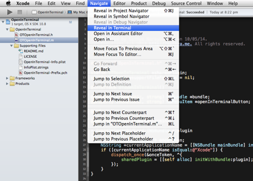

#Open In Terminal for Xcode

Open In Terminal is a plugin for xcode to open the selected file's directory in terminal. This helps you to easily reach the current active file in terminal.

### Installation
You can either

* Use [Alcatraz](http://alcatraz.io/)
* Download/Clone the source and build it (`cmd` + `B`) in Xcode.

### Uninstallation
Just delete the bundle with the name of `OpenInTerminal.xcplugin` in

    ~/Library/Application Support/Developer/Shared/Xcode/Plug-ins
     
### Author
Sathya Narayanan | [@sathyaio](https://twitter.com/sathyaio)  
  
    
    